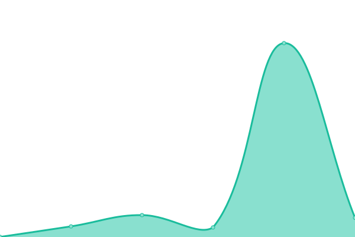
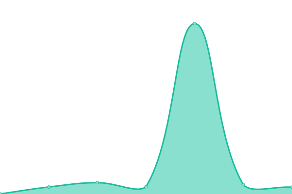

# [📈 Live Status](https://n-a-t-e.github.io/hakai-datasets-upptime): <!--live status--> **🟧 Partial outage**

This repository contains the open-source uptime monitor and status page for [Nate](https://n-a-t-e.github.io/hakai-datasets-upptime), powered by [Upptime](https://github.com/upptime/upptime).

With [Upptime](https://upptime.js.org), you can get your own unlimited and free uptime monitor and status page, powered entirely by a GitHub repository. We use [Issues](https://github.com/n-a-t-e/hakai-datasets-upptime/issues) as incident reports, [Actions](https://github.com/n-a-t-e/hakai-datasets-upptime/actions) as uptime monitors, and [Pages](https://n-a-t-e.github.io/hakai-datasets-upptime) for the status page.

<!--start: status pages-->
<!-- This summary is generated by Upptime (https://github.com/upptime/upptime) -->
<!-- Do not edit this manually, your changes will be overwritten -->
<!-- prettier-ignore -->
| URL | Status | History | Response Time | Uptime |
| --- | ------ | ------- | ------------- | ------ |
|  [HakaiADCPTimeSeriesProfileProvisional](https://catalogue.hakai.org/erddap/tabledap/HakaiADCPTimeSeriesProfileProvisional.htmlTable?time&time<=now-1week&distinct()) | 🟩 Up | [hakai-adcp-time-series-profile-provisional.yml](https://github.com/HakaiInstitute/hakai-datasets-upptime/commits/HEAD/history/hakai-adcp-time-series-profile-provisional.yml) | 

 4356ms
     
 | 

<a href="https://hakai-it.github.io/hakai-datasets-upptime/history/hakai-adcp-time-series-profile-provisional">100.00%</a>
    

|  [HakaiSewardBoL5min](https://catalogue.hakai.org/erddap/tabledap/HakaiSewardBoL5min.htmlTable?time&time<=now-1week&distinct()) | 🟩 Up | [hakai-seward-bo-l5min.yml](https://github.com/HakaiInstitute/hakai-datasets-upptime/commits/HEAD/history/hakai-seward-bo-l5min.yml) | 

 2711ms
     
 | 

<a href="https://hakai-it.github.io/hakai-datasets-upptime/history/hakai-seward-bo-l5min">73.47%</a>
    

|  [HakaiQuadraBoLResearch](https://catalogue.hakai.org/erddap/tabledap/HakaiQuadraBoLResearch.htmlTable?time&time<=now-1week&distinct()) | 🟩 Up | [hakai-quadra-bo-l-research.yml](https://github.com/HakaiInstitute/hakai-datasets-upptime/commits/HEAD/history/hakai-quadra-bo-l-research.yml) | 

 5582ms
     
 | 

<a href="https://hakai-it.github.io/hakai-datasets-upptime/history/hakai-quadra-bo-l-research">100.00%</a>
    

|  [HakaiBaynesSoundBoL5min](https://catalogue.hakai.org/erddap/tabledap/HakaiBaynesSoundBoL5min.htmlTable?time&time<=now-1week&distinct()) | 🟩 Up | [hakai-baynes-sound-bo-l5min.yml](https://github.com/HakaiInstitute/hakai-datasets-upptime/commits/HEAD/history/hakai-baynes-sound-bo-l5min.yml) | 

 2070ms
     
 | 

<a href="https://hakai-it.github.io/hakai-datasets-upptime/history/hakai-baynes-sound-bo-l5min">71.59%</a>
    

|  [HakaiKetchikanBoLResearch](https://catalogue.hakai.org/erddap/tabledap/HakaiKetchikanBoLResearch.htmlTable?time&time<=now-1week&distinct()) | 🟩 Up | [hakai-ketchikan-bo-l-research.yml](https://github.com/HakaiInstitute/hakai-datasets-upptime/commits/HEAD/history/hakai-ketchikan-bo-l-research.yml) | 

 849ms
     
 | 

<a href="https://hakai-it.github.io/hakai-datasets-upptime/history/hakai-ketchikan-bo-l-research">100.00%</a>
    

|  [HakaiSitkaBoL5min](https://catalogue.hakai.org/erddap/tabledap/HakaiSitkaBoL5min.htmlTable?time&time<=now-1week&distinct()) | 🟩 Up | [hakai-sitka-bo-l5min.yml](https://github.com/HakaiInstitute/hakai-datasets-upptime/commits/HEAD/history/hakai-sitka-bo-l5min.yml) | 

 934ms
     
 | 

<a href="https://hakai-it.github.io/hakai-datasets-upptime/history/hakai-sitka-bo-l5min">73.48%</a>
    

|  [HakaiADCPTimeSeriesProfileProvisional](https://catalogue.hakai.org/erddap/tabledap/HakaiADCPTimeSeriesProfileProvisional.htmlTable?time&time<=now-1week&distinct()) | 🟩 Up | [hakai-adcp-time-series-profile-provisional.yml](https://github.com/HakaiInstitute/hakai-datasets-upptime/commits/HEAD/history/hakai-adcp-time-series-profile-provisional.yml) | 

 4356ms
     
 | 

<a href="https://hakai-it.github.io/hakai-datasets-upptime/history/hakai-adcp-time-series-profile-provisional">100.00%</a>
    

|  [HakaiWaterPropertiesInstrumentProfileProvisional](https://catalogue.hakai.org/erddap/tabledap/HakaiWaterPropertiesInstrumentProfileProvisional.htmlTable?time&time<=now-1week&distinct()) | 🟩 Up | [hakai-water-properties-instrument-profile-provisional.yml](https://github.com/HakaiInstitute/hakai-datasets-upptime/commits/HEAD/history/hakai-water-properties-instrument-profile-provisional.yml) | 

 12912ms
     
 | 

<a href="https://hakai-it.github.io/hakai-datasets-upptime/history/hakai-water-properties-instrument-profile-provisional">100.00%</a>
    

|  [HakaiMooredTimeSeriesResearch](https://catalogue.hakai.org/erddap/tabledap/HakaiMooredTimeSeriesResearch.htmlTable?time&time<=now-1week&distinct()) | 🟩 Up | [hakai-moored-time-series-research.yml](https://github.com/HakaiInstitute/hakai-datasets-upptime/commits/HEAD/history/hakai-moored-time-series-research.yml) | 

 876ms
     
 | 

<a href="https://hakai-it.github.io/hakai-datasets-upptime/history/hakai-moored-time-series-research">100.00%</a>
    

|  [HakaiCalvertCP1TideGauge](https://catalogue.hakai.org/erddap/tabledap/HakaiCalvertCP1TideGauge.htmlTable?time&time<=now-1week&distinct()) | 🟩 Up | [hakai-calvert-cp-1-tide-gauge.yml](https://github.com/HakaiInstitute/hakai-datasets-upptime/commits/HEAD/history/hakai-calvert-cp-1-tide-gauge.yml) | 

 241ms
     
 | 

<a href="https://hakai-it.github.io/hakai-datasets-upptime/history/hakai-calvert-cp-1-tide-gauge">100.00%</a>
    

|  [HakaiQuadraBoL5min](https://catalogue.hakai.org/erddap/tabledap/HakaiQuadraBoL5min.htmlTable?time&time<=now-1week&distinct()) | 🟩 Up | [hakai-quadra-bo-l5min.yml](https://github.com/HakaiInstitute/hakai-datasets-upptime/commits/HEAD/history/hakai-quadra-bo-l5min.yml) | 

 963ms
     
 | 

<a href="https://hakai-it.github.io/hakai-datasets-upptime/history/hakai-quadra-bo-l5min">72.07%</a>
    

|  [HakaiKodiakBoL5min](https://catalogue.hakai.org/erddap/tabledap/HakaiKodiakBoL5min.htmlTable?time&time<=now-1week&distinct()) | 🟩 Up | [hakai-kodiak-bo-l5min.yml](https://github.com/HakaiInstitute/hakai-datasets-upptime/commits/HEAD/history/hakai-kodiak-bo-l5min.yml) | 

 1023ms
     
 | 

<a href="https://hakai-it.github.io/hakai-datasets-upptime/history/hakai-kodiak-bo-l5min">71.93%</a>
    

|  [HakaiKetchikanBoL5min](https://catalogue.hakai.org/erddap/tabledap/HakaiKetchikanBoL5min.htmlTable?time&time<=now-1week&distinct()) | 🟩 Up | [hakai-ketchikan-bo-l5min.yml](https://github.com/HakaiInstitute/hakai-datasets-upptime/commits/HEAD/history/hakai-ketchikan-bo-l5min.yml) | 

 2115ms
     
 | 

<a href="https://hakai-it.github.io/hakai-datasets-upptime/history/hakai-ketchikan-bo-l5min">71.94%</a>
    

|  [HakaiKCBuoyResearch](https://catalogue.hakai.org/erddap/tabledap/HakaiKCBuoyResearch.htmlTable?time&time<=now-1week&distinct()) | 🟩 Up | [hakai-kc-buoy-research.yml](https://github.com/HakaiInstitute/hakai-datasets-upptime/commits/HEAD/history/hakai-kc-buoy-research.yml) | 

 659ms
     
 | 

<a href="https://hakai-it.github.io/hakai-datasets-upptime/history/hakai-kc-buoy-research">100.00%</a>
    

|  [HakaiPruthDockProvisional](https://catalogue.hakai.org/erddap/tabledap/HakaiPruthDockProvisional.htmlTable?time&time<=now-1week&distinct()) | 🟩 Up | [hakai-pruth-dock-provisional.yml](https://github.com/HakaiInstitute/hakai-datasets-upptime/commits/HEAD/history/hakai-pruth-dock-provisional.yml) | 

 2072ms
     
 | 

<a href="https://hakai-it.github.io/hakai-datasets-upptime/history/hakai-pruth-dock-provisional">100.00%</a>
    

|  [HakaiQuadraWeather5min](https://catalogue.hakai.org/erddap/tabledap/HakaiQuadraWeather5min.htmlTable?time&time<=now-1week&distinct()) | 🟩 Up | [hakai-quadra-weather5min.yml](https://github.com/HakaiInstitute/hakai-datasets-upptime/commits/HEAD/history/hakai-quadra-weather5min.yml) | 

 928ms
     
 | 

<a href="https://hakai-it.github.io/hakai-datasets-upptime/history/hakai-quadra-weather5min">71.94%</a>
    

|  [HakaiQU5MMooringProvisional](https://catalogue.hakai.org/erddap/tabledap/HakaiQU5MMooringProvisional.htmlTable?time&time<=now-1week&distinct()) | 🟩 Up | [hakai-qu-5-m-mooring-provisional.yml](https://github.com/HakaiInstitute/hakai-datasets-upptime/commits/HEAD/history/hakai-qu-5-m-mooring-provisional.yml) | 

 8721ms
     
 | 

<a href="https://hakai-it.github.io/hakai-datasets-upptime/history/hakai-qu-5-m-mooring-provisional">71.93%</a>
    

|  [HakaiWaterPropertiesInstrumentProfileResearch](https://catalogue.hakai.org/erddap/tabledap/HakaiWaterPropertiesInstrumentProfileResearch.htmlTable?time&time<=now-1week&distinct()) | 🟩 Up | [hakai-water-properties-instrument-profile-research.yml](https://github.com/HakaiInstitute/hakai-datasets-upptime/commits/HEAD/history/hakai-water-properties-instrument-profile-research.yml) | 

 7678ms
     
 | 

<a href="https://hakai-it.github.io/hakai-datasets-upptime/history/hakai-water-properties-instrument-profile-research">100.00%</a>
    

|  [HakaiKCBuoy1hour](https://catalogue.hakai.org/erddap/tabledap/HakaiKCBuoy1hour.htmlTable?time&time<=now-1week&distinct()) | 🟩 Up | [hakai-kc-buoy1hour.yml](https://github.com/HakaiInstitute/hakai-datasets-upptime/commits/HEAD/history/hakai-kc-buoy1hour.yml) | 

 854ms
     
 | 

<a href="https://hakai-it.github.io/hakai-datasets-upptime/history/hakai-kc-buoy1hour">77.94%</a>
    

|  [HakaiSitkaBoLResearch](https://catalogue.hakai.org/erddap/tabledap/HakaiSitkaBoLResearch.htmlTable?time&time<=now-1week&distinct()) | 🟩 Up | [hakai-sitka-bo-l-research.yml](https://github.com/HakaiInstitute/hakai-datasets-upptime/commits/HEAD/history/hakai-sitka-bo-l-research.yml) | 

 2115ms
     
 | 

<a href="https://hakai-it.github.io/hakai-datasets-upptime/history/hakai-sitka-bo-l-research">100.00%</a>
    

|  [HakaiQuadraLimpet5min](https://catalogue.hakai.org/erddap/tabledap/HakaiQuadraLimpet5min.htmlTable?time&time<=now-1week&distinct()) | 🟩 Up | [hakai-quadra-limpet5min.yml](https://github.com/HakaiInstitute/hakai-datasets-upptime/commits/HEAD/history/hakai-quadra-limpet5min.yml) | 

 898ms
     
 | 

<a href="https://hakai-it.github.io/hakai-datasets-upptime/history/hakai-quadra-limpet5min">77.95%</a>
    

|  [HakaiColumbiaFerryResearch](https://catalogue.hakai.org/erddap/tabledap/HakaiColumbiaFerryResearch.htmlTable?time&time<=now-1week&distinct()) | 🟩 Up | [hakai-columbia-ferry-research.yml](https://github.com/HakaiInstitute/hakai-datasets-upptime/commits/HEAD/history/hakai-columbia-ferry-research.yml) | 

 3520ms
     
 | 

<a href="https://hakai-it.github.io/hakai-datasets-upptime/history/hakai-columbia-ferry-research">100.00%</a>
    

|  [HakaiPruthMooringProvisional](https://catalogue.hakai.org/erddap/tabledap/HakaiPruthMooringProvisional.htmlTable?time&time<=now-1week&distinct()) | 🟩 Up | [hakai-pruth-mooring-provisional.yml](https://github.com/HakaiInstitute/hakai-datasets-upptime/commits/HEAD/history/hakai-pruth-mooring-provisional.yml) | 

 7164ms
     
 | 

<a href="https://hakai-it.github.io/hakai-datasets-upptime/history/hakai-pruth-mooring-provisional">77.94%</a>
    

|  [https://catalogue.hakai.org/erddap/tabledap/HakaiADCPTimeSeriesProfileProvisional](https://catalogue.hakai.org/erddap/tabledap/HakaiADCPTimeSeriesProfileProvisional.htmlTable?&time>now-1minute) | 🟩 Up | [https-catalogue-hakai-org-erddap-tabledap-hakai-adcp-time-series-profile-provisional.yml](https://github.com/HakaiInstitute/hakai-datasets-upptime/commits/HEAD/history/https-catalogue-hakai-org-erddap-tabledap-hakai-adcp-time-series-profile-provisional.yml) | 

 2047ms
     
 | 

<a href="https://hakai-it.github.io/hakai-datasets-upptime/history/https-catalogue-hakai-org-erddap-tabledap-hakai-adcp-time-series-profile-provisional">100.00%</a>
    

|  [https://catalogue.hakai.org/erddap/tabledap/HakaiMooredTimeSeriesResearch](https://catalogue.hakai.org/erddap/tabledap/HakaiMooredTimeSeriesResearch.htmlTable?&time>now-1minute) | 🟩 Up | [https-catalogue-hakai-org-erddap-tabledap-hakai-moored-time-series-research.yml](https://github.com/HakaiInstitute/hakai-datasets-upptime/commits/HEAD/history/https-catalogue-hakai-org-erddap-tabledap-hakai-moored-time-series-research.yml) | 

 2039ms
     
 | 

<a href="https://hakai-it.github.io/hakai-datasets-upptime/history/https-catalogue-hakai-org-erddap-tabledap-hakai-moored-time-series-research">100.00%</a>
    

|  [https://catalogue.hakai.org/erddap/tabledap/HakaiWaterPropertiesInstrumentProfileProvisional](https://catalogue.hakai.org/erddap/tabledap/HakaiWaterPropertiesInstrumentProfileProvisional.htmlTable?&time>now-1minute) | 🟩 Up | [https-catalogue-hakai-org-erddap-tabledap-hakai-water-properties-instrument-profile-provisional.yml](https://github.com/HakaiInstitute/hakai-datasets-upptime/commits/HEAD/history/https-catalogue-hakai-org-erddap-tabledap-hakai-water-properties-instrument-profile-provisional.yml) | 

 2700ms
     
 | 

<a href="https://hakai-it.github.io/hakai-datasets-upptime/history/https-catalogue-hakai-org-erddap-tabledap-hakai-water-properties-instrument-profile-provisional">100.00%</a>
    

|  [https://catalogue.hakai.org/erddap/tabledap/HakaiWaterPropertiesInstrumentProfileResearch](https://catalogue.hakai.org/erddap/tabledap/HakaiWaterPropertiesInstrumentProfileResearch.htmlTable?&time>now-1minute) | 🟩 Up | [https-catalogue-hakai-org-erddap-tabledap-hakai-water-properties-instrument-profile-research.yml](https://github.com/HakaiInstitute/hakai-datasets-upptime/commits/HEAD/history/https-catalogue-hakai-org-erddap-tabledap-hakai-water-properties-instrument-profile-research.yml) | 

 2424ms
     
 | 

<a href="https://hakai-it.github.io/hakai-datasets-upptime/history/https-catalogue-hakai-org-erddap-tabledap-hakai-water-properties-instrument-profile-research">100.00%</a>
    

|  [https://catalogue.hakai.org/erddap/tabledap/HakaiQuadraBoLResearch](https://catalogue.hakai.org/erddap/tabledap/HakaiQuadraBoLResearch.htmlTable?&time>now-1minute) | 🟩 Up | [https-catalogue-hakai-org-erddap-tabledap-hakai-quadra-bo-l-research.yml](https://github.com/HakaiInstitute/hakai-datasets-upptime/commits/HEAD/history/https-catalogue-hakai-org-erddap-tabledap-hakai-quadra-bo-l-research.yml) | 

 2071ms
     
 | 

<a href="https://hakai-it.github.io/hakai-datasets-upptime/history/https-catalogue-hakai-org-erddap-tabledap-hakai-quadra-bo-l-research">100.00%</a>
    

|  [https://catalogue.hakai.org/erddap/tabledap/HakaiSitkaBoLResearch](https://catalogue.hakai.org/erddap/tabledap/HakaiSitkaBoLResearch.htmlTable?&time>now-1minute) | 🟩 Up | [https-catalogue-hakai-org-erddap-tabledap-hakai-sitka-bo-l-research.yml](https://github.com/HakaiInstitute/hakai-datasets-upptime/commits/HEAD/history/https-catalogue-hakai-org-erddap-tabledap-hakai-sitka-bo-l-research.yml) | 

 2038ms
     
 | 

<a href="https://hakai-it.github.io/hakai-datasets-upptime/history/https-catalogue-hakai-org-erddap-tabledap-hakai-sitka-bo-l-research">100.00%</a>
    

|  [https://catalogue.hakai.org/erddap/tabledap/HakaiKetchikanBoLResearch](https://catalogue.hakai.org/erddap/tabledap/HakaiKetchikanBoLResearch.htmlTable?&time>now-1minute) | 🟩 Up | [https-catalogue-hakai-org-erddap-tabledap-hakai-ketchikan-bo-l-research.yml](https://github.com/HakaiInstitute/hakai-datasets-upptime/commits/HEAD/history/https-catalogue-hakai-org-erddap-tabledap-hakai-ketchikan-bo-l-research.yml) | 

 2038ms
     
 | 

<a href="https://hakai-it.github.io/hakai-datasets-upptime/history/https-catalogue-hakai-org-erddap-tabledap-hakai-ketchikan-bo-l-research">100.00%</a>
    

|  [https://catalogue.hakai.org/erddap/tabledap/HakaiQuadraWeather5min](https://catalogue.hakai.org/erddap/tabledap/HakaiQuadraWeather5min.htmlTable?&time>now-1minute) | 🟩 Up | [https-catalogue-hakai-org-erddap-tabledap-hakai-quadra-weather5min.yml](https://github.com/HakaiInstitute/hakai-datasets-upptime/commits/HEAD/history/https-catalogue-hakai-org-erddap-tabledap-hakai-quadra-weather5min.yml) | 

 2107ms
     
 | 

<a href="https://hakai-it.github.io/hakai-datasets-upptime/history/https-catalogue-hakai-org-erddap-tabledap-hakai-quadra-weather5min">100.00%</a>
    

|  [https://catalogue.hakai.org/erddap/tabledap/HakaiQuadraLimpet5min](https://catalogue.hakai.org/erddap/tabledap/HakaiQuadraLimpet5min.htmlTable?&time>now-1minute) | 🟩 Up | [https-catalogue-hakai-org-erddap-tabledap-hakai-quadra-limpet5min.yml](https://github.com/HakaiInstitute/hakai-datasets-upptime/commits/HEAD/history/https-catalogue-hakai-org-erddap-tabledap-hakai-quadra-limpet5min.yml) | 

 2085ms
     
 | 

<a href="https://hakai-it.github.io/hakai-datasets-upptime/history/https-catalogue-hakai-org-erddap-tabledap-hakai-quadra-limpet5min">100.00%</a>
    

|  [Real-Time: https://catalogue.hakai.org/erddap/tabledap/HakaiQuadraLimpet5min](https://catalogue.hakai.org/erddap/tabledap/HakaiQuadraLimpet5min.htmlTable?time&time>=now-1day) | 🟩 Up | [real-time-https-catalogue-hakai-org-erddap-tabledap-hakai-quadra-limpet5min.yml](https://github.com/HakaiInstitute/hakai-datasets-upptime/commits/HEAD/history/real-time-https-catalogue-hakai-org-erddap-tabledap-hakai-quadra-limpet5min.yml) | 

 112ms
     
 | 

<a href="https://hakai-it.github.io/hakai-datasets-upptime/history/real-time-https-catalogue-hakai-org-erddap-tabledap-hakai-quadra-limpet5min">100.00%</a>
    

|  [https://catalogue.hakai.org/erddap/tabledap/HakaiPruthMooringProvisional](https://catalogue.hakai.org/erddap/tabledap/HakaiPruthMooringProvisional.htmlTable?&time>now-1minute) | 🟩 Up | [https-catalogue-hakai-org-erddap-tabledap-hakai-pruth-mooring-provisional.yml](https://github.com/HakaiInstitute/hakai-datasets-upptime/commits/HEAD/history/https-catalogue-hakai-org-erddap-tabledap-hakai-pruth-mooring-provisional.yml) | 

 2081ms
     
 | 

<a href="https://hakai-it.github.io/hakai-datasets-upptime/history/https-catalogue-hakai-org-erddap-tabledap-hakai-pruth-mooring-provisional">100.00%</a>
    

|  [https://catalogue.hakai.org/erddap/tabledap/HakaiPruthDockProvisional](https://catalogue.hakai.org/erddap/tabledap/HakaiPruthDockProvisional.htmlTable?&time>now-1minute) | 🟩 Up | [https-catalogue-hakai-org-erddap-tabledap-hakai-pruth-dock-provisional.yml](https://github.com/HakaiInstitute/hakai-datasets-upptime/commits/HEAD/history/https-catalogue-hakai-org-erddap-tabledap-hakai-pruth-dock-provisional.yml) | 

 2077ms
     
 | 

<a href="https://hakai-it.github.io/hakai-datasets-upptime/history/https-catalogue-hakai-org-erddap-tabledap-hakai-pruth-dock-provisional">100.00%</a>
    

|  [https://catalogue.hakai.org/erddap/tabledap/HakaiQU5MMooringProvisional](https://catalogue.hakai.org/erddap/tabledap/HakaiQU5MMooringProvisional.htmlTable?&time>now-1minute) | 🟩 Up | [https-catalogue-hakai-org-erddap-tabledap-hakai-qu-5-m-mooring-provisional.yml](https://github.com/HakaiInstitute/hakai-datasets-upptime/commits/HEAD/history/https-catalogue-hakai-org-erddap-tabledap-hakai-qu-5-m-mooring-provisional.yml) | 

 5835ms
     
 | 

<a href="https://hakai-it.github.io/hakai-datasets-upptime/history/https-catalogue-hakai-org-erddap-tabledap-hakai-qu-5-m-mooring-provisional">100.00%</a>
    

|  [https://catalogue.hakai.org/erddap/tabledap/HakaiBaynesSoundBoL5min](https://catalogue.hakai.org/erddap/tabledap/HakaiBaynesSoundBoL5min.htmlTable?&time>now-1minute) | 🟩 Up | [https-catalogue-hakai-org-erddap-tabledap-hakai-baynes-sound-bo-l5min.yml](https://github.com/HakaiInstitute/hakai-datasets-upptime/commits/HEAD/history/https-catalogue-hakai-org-erddap-tabledap-hakai-baynes-sound-bo-l5min.yml) | 

 2106ms
     
 | 

<a href="https://hakai-it.github.io/hakai-datasets-upptime/history/https-catalogue-hakai-org-erddap-tabledap-hakai-baynes-sound-bo-l5min">100.00%</a>
    

|  [Real-Time: https://catalogue.hakai.org/erddap/tabledap/HakaiBaynesSoundBoL5min](https://catalogue.hakai.org/erddap/tabledap/HakaiBaynesSoundBoL5min.htmlTable?time&time>=now-1day) | 🟥 Down | [real-time-https-catalogue-hakai-org-erddap-tabledap-hakai-baynes-sound-bo-l5min.yml](https://github.com/HakaiInstitute/hakai-datasets-upptime/commits/HEAD/history/real-time-https-catalogue-hakai-org-erddap-tabledap-hakai-baynes-sound-bo-l5min.yml) | 

 2073ms
     
 | 

<a href="https://hakai-it.github.io/hakai-datasets-upptime/history/real-time-https-catalogue-hakai-org-erddap-tabledap-hakai-baynes-sound-bo-l5min">100.00%</a>
    

|  [https://catalogue.hakai.org/erddap/tabledap/HakaiQuadraBoL5min](https://catalogue.hakai.org/erddap/tabledap/HakaiQuadraBoL5min.htmlTable?&time>now-1minute) | 🟩 Up | [https-catalogue-hakai-org-erddap-tabledap-hakai-quadra-bo-l5min.yml](https://github.com/HakaiInstitute/hakai-datasets-upptime/commits/HEAD/history/https-catalogue-hakai-org-erddap-tabledap-hakai-quadra-bo-l5min.yml) | 

 2086ms
     
 | 

<a href="https://hakai-it.github.io/hakai-datasets-upptime/history/https-catalogue-hakai-org-erddap-tabledap-hakai-quadra-bo-l5min">100.00%</a>
    

|  [Real-Time: https://catalogue.hakai.org/erddap/tabledap/HakaiQuadraBoL5min](https://catalogue.hakai.org/erddap/tabledap/HakaiQuadraBoL5min.htmlTable?time&time>=now-1day) | 🟩 Up | [real-time-https-catalogue-hakai-org-erddap-tabledap-hakai-quadra-bo-l5min.yml](https://github.com/HakaiInstitute/hakai-datasets-upptime/commits/HEAD/history/real-time-https-catalogue-hakai-org-erddap-tabledap-hakai-quadra-bo-l5min.yml) | 

 112ms
     
 | 

<a href="https://hakai-it.github.io/hakai-datasets-upptime/history/real-time-https-catalogue-hakai-org-erddap-tabledap-hakai-quadra-bo-l5min">100.00%</a>
    

|  [https://catalogue.hakai.org/erddap/tabledap/HakaiKodiakBoL5min](https://catalogue.hakai.org/erddap/tabledap/HakaiKodiakBoL5min.htmlTable?&time>now-1minute) | 🟩 Up | [https-catalogue-hakai-org-erddap-tabledap-hakai-kodiak-bo-l5min.yml](https://github.com/HakaiInstitute/hakai-datasets-upptime/commits/HEAD/history/https-catalogue-hakai-org-erddap-tabledap-hakai-kodiak-bo-l5min.yml) | 

 2142ms
     
 | 

<a href="https://hakai-it.github.io/hakai-datasets-upptime/history/https-catalogue-hakai-org-erddap-tabledap-hakai-kodiak-bo-l5min">100.00%</a>
    

|  [Real-Time: https://catalogue.hakai.org/erddap/tabledap/HakaiKodiakBoL5min](https://catalogue.hakai.org/erddap/tabledap/HakaiKodiakBoL5min.htmlTable?time&time>=now-1day) | 🟥 Down | [real-time-https-catalogue-hakai-org-erddap-tabledap-hakai-kodiak-bo-l5min.yml](https://github.com/HakaiInstitute/hakai-datasets-upptime/commits/HEAD/history/real-time-https-catalogue-hakai-org-erddap-tabledap-hakai-kodiak-bo-l5min.yml) | 

 2083ms
     
 | 

<a href="https://hakai-it.github.io/hakai-datasets-upptime/history/real-time-https-catalogue-hakai-org-erddap-tabledap-hakai-kodiak-bo-l5min">100.00%</a>
    

|  [https://catalogue.hakai.org/erddap/tabledap/HakaiSewardBoL5min](https://catalogue.hakai.org/erddap/tabledap/HakaiSewardBoL5min.htmlTable?&time>now-1minute) | 🟩 Up | [https-catalogue-hakai-org-erddap-tabledap-hakai-seward-bo-l5min.yml](https://github.com/HakaiInstitute/hakai-datasets-upptime/commits/HEAD/history/https-catalogue-hakai-org-erddap-tabledap-hakai-seward-bo-l5min.yml) | 

 2093ms
     
 | 

<a href="https://hakai-it.github.io/hakai-datasets-upptime/history/https-catalogue-hakai-org-erddap-tabledap-hakai-seward-bo-l5min">100.00%</a>
    

|  [Real-Time: https://catalogue.hakai.org/erddap/tabledap/HakaiSewardBoL5min](https://catalogue.hakai.org/erddap/tabledap/HakaiSewardBoL5min.htmlTable?time&time>=now-1day) | 🟥 Down | [real-time-https-catalogue-hakai-org-erddap-tabledap-hakai-seward-bo-l5min.yml](https://github.com/HakaiInstitute/hakai-datasets-upptime/commits/HEAD/history/real-time-https-catalogue-hakai-org-erddap-tabledap-hakai-seward-bo-l5min.yml) | 

 2072ms
     
 | 

<a href="https://hakai-it.github.io/hakai-datasets-upptime/history/real-time-https-catalogue-hakai-org-erddap-tabledap-hakai-seward-bo-l5min">100.00%</a>
    

|  [https://catalogue.hakai.org/erddap/tabledap/HakaiKetchikanBoL5min](https://catalogue.hakai.org/erddap/tabledap/HakaiKetchikanBoL5min.htmlTable?&time>now-1minute) | 🟩 Up | [https-catalogue-hakai-org-erddap-tabledap-hakai-ketchikan-bo-l5min.yml](https://github.com/HakaiInstitute/hakai-datasets-upptime/commits/HEAD/history/https-catalogue-hakai-org-erddap-tabledap-hakai-ketchikan-bo-l5min.yml) | 

 2100ms
     
 | 

<a href="https://hakai-it.github.io/hakai-datasets-upptime/history/https-catalogue-hakai-org-erddap-tabledap-hakai-ketchikan-bo-l5min">100.00%</a>
    

|  [Real-Time: https://catalogue.hakai.org/erddap/tabledap/HakaiKetchikanBoL5min](https://catalogue.hakai.org/erddap/tabledap/HakaiKetchikanBoL5min.htmlTable?time&time>=now-1day) | 🟥 Down | [real-time-https-catalogue-hakai-org-erddap-tabledap-hakai-ketchikan-bo-l5min.yml](https://github.com/HakaiInstitute/hakai-datasets-upptime/commits/HEAD/history/real-time-https-catalogue-hakai-org-erddap-tabledap-hakai-ketchikan-bo-l5min.yml) | 

 2069ms
     
 | 

<a href="https://hakai-it.github.io/hakai-datasets-upptime/history/real-time-https-catalogue-hakai-org-erddap-tabledap-hakai-ketchikan-bo-l5min">100.00%</a>
    

|  [https://catalogue.hakai.org/erddap/tabledap/HakaiSitkaBoL5min](https://catalogue.hakai.org/erddap/tabledap/HakaiSitkaBoL5min.htmlTable?&time>now-1minute) | 🟩 Up | [https-catalogue-hakai-org-erddap-tabledap-hakai-sitka-bo-l5min.yml](https://github.com/HakaiInstitute/hakai-datasets-upptime/commits/HEAD/history/https-catalogue-hakai-org-erddap-tabledap-hakai-sitka-bo-l5min.yml) | 

 2077ms
     
 | 

<a href="https://hakai-it.github.io/hakai-datasets-upptime/history/https-catalogue-hakai-org-erddap-tabledap-hakai-sitka-bo-l5min">100.00%</a>
    

|  [Real-Time: https://catalogue.hakai.org/erddap/tabledap/HakaiSitkaBoL5min](https://catalogue.hakai.org/erddap/tabledap/HakaiSitkaBoL5min.htmlTable?time&time>=now-1day) | 🟩 Up | [real-time-https-catalogue-hakai-org-erddap-tabledap-hakai-sitka-bo-l5min.yml](https://github.com/HakaiInstitute/hakai-datasets-upptime/commits/HEAD/history/real-time-https-catalogue-hakai-org-erddap-tabledap-hakai-sitka-bo-l5min.yml) | 

 89ms
     
 | 

<a href="https://hakai-it.github.io/hakai-datasets-upptime/history/real-time-https-catalogue-hakai-org-erddap-tabledap-hakai-sitka-bo-l5min">100.00%</a>
    

|  [https://catalogue.hakai.org/erddap/tabledap/HakaiKCBuoy1hour](https://catalogue.hakai.org/erddap/tabledap/HakaiKCBuoy1hour.htmlTable?&time>now-1minute) | 🟩 Up | [https-catalogue-hakai-org-erddap-tabledap-hakai-kc-buoy1hour.yml](https://github.com/HakaiInstitute/hakai-datasets-upptime/commits/HEAD/history/https-catalogue-hakai-org-erddap-tabledap-hakai-kc-buoy1hour.yml) | 

 2211ms
     
 | 

<a href="https://hakai-it.github.io/hakai-datasets-upptime/history/https-catalogue-hakai-org-erddap-tabledap-hakai-kc-buoy1hour">100.00%</a>
    

|  [Real-Time: https://catalogue.hakai.org/erddap/tabledap/HakaiKCBuoy1hour](https://catalogue.hakai.org/erddap/tabledap/HakaiKCBuoy1hour.htmlTable?time&time>=now-1day) | 🟩 Up | [real-time-https-catalogue-hakai-org-erddap-tabledap-hakai-kc-buoy1hour.yml](https://github.com/HakaiInstitute/hakai-datasets-upptime/commits/HEAD/history/real-time-https-catalogue-hakai-org-erddap-tabledap-hakai-kc-buoy1hour.yml) | 

 90ms
     
 | 

<a href="https://hakai-it.github.io/hakai-datasets-upptime/history/real-time-https-catalogue-hakai-org-erddap-tabledap-hakai-kc-buoy1hour">100.00%</a>
    

|  [https://catalogue.hakai.org/erddap/tabledap/HakaiKCBuoyResearch](https://catalogue.hakai.org/erddap/tabledap/HakaiKCBuoyResearch.htmlTable?&time>now-1minute) | 🟩 Up | [https-catalogue-hakai-org-erddap-tabledap-hakai-kc-buoy-research.yml](https://github.com/HakaiInstitute/hakai-datasets-upptime/commits/HEAD/history/https-catalogue-hakai-org-erddap-tabledap-hakai-kc-buoy-research.yml) | 

 2038ms
     
 | 

<a href="https://hakai-it.github.io/hakai-datasets-upptime/history/https-catalogue-hakai-org-erddap-tabledap-hakai-kc-buoy-research">100.00%</a>
    

|  [https://catalogue.hakai.org/erddap/tabledap/HakaiColumbiaFerryResearch](https://catalogue.hakai.org/erddap/tabledap/HakaiColumbiaFerryResearch.htmlTable?&time>now-1minute) | 🟩 Up | [https-catalogue-hakai-org-erddap-tabledap-hakai-columbia-ferry-research.yml](https://github.com/HakaiInstitute/hakai-datasets-upptime/commits/HEAD/history/https-catalogue-hakai-org-erddap-tabledap-hakai-columbia-ferry-research.yml) | 

 2041ms
     
 | 

<a href="https://hakai-it.github.io/hakai-datasets-upptime/history/https-catalogue-hakai-org-erddap-tabledap-hakai-columbia-ferry-research">100.00%</a>
    

|  [https://catalogue.hakai.org/erddap/tabledap/HakaiCalvertCP1TideGauge](https://catalogue.hakai.org/erddap/tabledap/HakaiCalvertCP1TideGauge.htmlTable?&time>now-1minute) | 🟩 Up | [https-catalogue-hakai-org-erddap-tabledap-hakai-calvert-cp-1-tide-gauge.yml](https://github.com/HakaiInstitute/hakai-datasets-upptime/commits/HEAD/history/https-catalogue-hakai-org-erddap-tabledap-hakai-calvert-cp-1-tide-gauge.yml) | 

 2039ms
     
 | 

<a href="https://hakai-it.github.io/hakai-datasets-upptime/history/https-catalogue-hakai-org-erddap-tabledap-hakai-calvert-cp-1-tide-gauge">100.00%</a>
    

<!--end: status pages-->

[**Visit our status website →**](https://n-a-t-e.github.io/hakai-datasets-upptime)

## 📄 License

- Powered by: [Upptime](https://github.com/upptime/upptime)
- Code: [MIT](./LICENSE) © [Nate](https://n-a-t-e.github.io/hakai-datasets-upptime)
- Data in the `./history` directory: [Open Database License](https://opendatacommons.org/licenses/odbl/1-0/)
