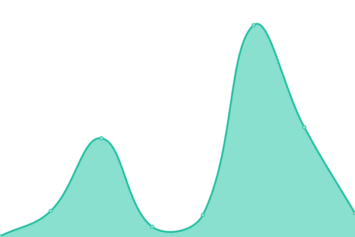
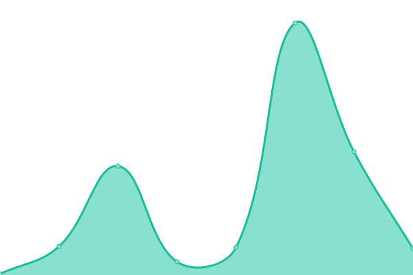

# [📈 Live Status](https://hakaiinstitute.github.io/hakai-datasets-upptime): <!--live status--> **🟧 Partial outage**

This repository contains the open-source uptime monitor and status page for the [Hakai Institute](https://hakaiinstitute.github.io/hakai-datasets-upptime), powered by [Upptime](https://github.com/upptime/upptime).

With [Upptime](https://upptime.js.org), you can get your own unlimited and free uptime monitor and status page, powered entirely by a GitHub repository. We use [Issues](https://github.com/hakaiinstitute/hakai-datasets-upptime/issues) as incident reports, [Actions](https://github.com/hakaiinstitute/hakai-datasets-upptime/actions) as uptime monitors, and [Pages](https://hakaiinstitute.github.io/hakai-datasets-upptime/) for the status page.

<!--start: status pages-->
<!-- This summary is generated by Upptime (https://github.com/upptime/upptime) -->
<!-- Do not edit this manually, your changes will be overwritten -->
<!-- prettier-ignore -->
| URL | Status | History | Response Time | Uptime |
| --- | ------ | ------- | ------------- | ------ |
|  [catalogue.hakai.org - HakaiADCPTimeSeriesProfileProvisional: Data Access Form](https://catalogue.hakai.org/erddap/tabledap/HakaiADCPTimeSeriesProfileProvisional.html) | 🟩 Up | [catalogue-hakai-org-hakai-adcp-time-series-profile-provisional-data-access-form.yml](https://github.com/HakaiInstitute/hakai-datasets-upptime/commits/HEAD/history/catalogue-hakai-org-hakai-adcp-time-series-profile-provisional-data-access-form.yml) | 

 977ms
     
 | 

<a href="https://HakaiInstitute.github.io/hakai-datasets-upptime/history/catalogue-hakai-org-hakai-adcp-time-series-profile-provisional-data-access-form">100.00%</a>
    

|  [catalogue.hakai.org - HakaiADCPTimeSeriesProfileProvisional: Download test](https://catalogue.hakai.org/erddap/tabledap/HakaiADCPTimeSeriesProfileProvisional.htmlTable?&time>now-1minute) | 🟩 Up | [catalogue-hakai-org-hakai-adcp-time-series-profile-provisional-download-test.yml](https://github.com/HakaiInstitute/hakai-datasets-upptime/commits/HEAD/history/catalogue-hakai-org-hakai-adcp-time-series-profile-provisional-download-test.yml) | 

 2500ms
     
 | 

<a href="https://HakaiInstitute.github.io/hakai-datasets-upptime/history/catalogue-hakai-org-hakai-adcp-time-series-profile-provisional-download-test">100.00%</a>
    

|  [catalogue.hakai.org - HakaiMooredTimeSeriesResearch: Data Access Form](https://catalogue.hakai.org/erddap/tabledap/HakaiMooredTimeSeriesResearch.html) | 🟩 Up | [catalogue-hakai-org-hakai-moored-time-series-research-data-access-form.yml](https://github.com/HakaiInstitute/hakai-datasets-upptime/commits/HEAD/history/catalogue-hakai-org-hakai-moored-time-series-research-data-access-form.yml) | 

 886ms
     
 | 

<a href="https://HakaiInstitute.github.io/hakai-datasets-upptime/history/catalogue-hakai-org-hakai-moored-time-series-research-data-access-form">100.00%</a>
    

|  [catalogue.hakai.org - HakaiMooredTimeSeriesResearch: Download test](https://catalogue.hakai.org/erddap/tabledap/HakaiMooredTimeSeriesResearch.htmlTable?&time>now-1minute) | 🟩 Up | [catalogue-hakai-org-hakai-moored-time-series-research-download-test.yml](https://github.com/HakaiInstitute/hakai-datasets-upptime/commits/HEAD/history/catalogue-hakai-org-hakai-moored-time-series-research-download-test.yml) | 

 2389ms
     
 | 

<a href="https://HakaiInstitute.github.io/hakai-datasets-upptime/history/catalogue-hakai-org-hakai-moored-time-series-research-download-test">100.00%</a>
    

|  [catalogue.hakai.org - HakaiWaterPropertiesInstrumentProfileProvisional: Data Access Form](https://catalogue.hakai.org/erddap/tabledap/HakaiWaterPropertiesInstrumentProfileProvisional.html) | 🟩 Up | [catalogue-hakai-org-hakai-water-properties-instrument-profile-provisional-data-access-form.yml](https://github.com/HakaiInstitute/hakai-datasets-upptime/commits/HEAD/history/catalogue-hakai-org-hakai-water-properties-instrument-profile-provisional-data-access-form.yml) | 

 75ms
     
 | 

<a href="https://HakaiInstitute.github.io/hakai-datasets-upptime/history/catalogue-hakai-org-hakai-water-properties-instrument-profile-provisional-data-access-form">100.00%</a>
    

|  [catalogue.hakai.org - HakaiWaterPropertiesInstrumentProfileProvisional: Download test](https://catalogue.hakai.org/erddap/tabledap/HakaiWaterPropertiesInstrumentProfileProvisional.htmlTable?&time>now-1minute) | 🟥 Down | [catalogue-hakai-org-hakai-water-properties-instrument-profile-provisional-download-test.yml](https://github.com/HakaiInstitute/hakai-datasets-upptime/commits/HEAD/history/catalogue-hakai-org-hakai-water-properties-instrument-profile-provisional-download-test.yml) | 

 16165ms
     
 | 

<a href="https://HakaiInstitute.github.io/hakai-datasets-upptime/history/catalogue-hakai-org-hakai-water-properties-instrument-profile-provisional-download-test">100.00%</a>
    

|  [catalogue.hakai.org - HakaiWaterPropertiesInstrumentProfileResearch: Data Access Form](https://catalogue.hakai.org/erddap/tabledap/HakaiWaterPropertiesInstrumentProfileResearch.html) | 🟩 Up | [catalogue-hakai-org-hakai-water-properties-instrument-profile-research-data-access-form.yml](https://github.com/HakaiInstitute/hakai-datasets-upptime/commits/HEAD/history/catalogue-hakai-org-hakai-water-properties-instrument-profile-research-data-access-form.yml) | 

 911ms
     
 | 

<a href="https://HakaiInstitute.github.io/hakai-datasets-upptime/history/catalogue-hakai-org-hakai-water-properties-instrument-profile-research-data-access-form">100.00%</a>
    

|  [catalogue.hakai.org - HakaiWaterPropertiesInstrumentProfileResearch: Download test](https://catalogue.hakai.org/erddap/tabledap/HakaiWaterPropertiesInstrumentProfileResearch.htmlTable?&time>now-1minute) | 🟩 Up | [catalogue-hakai-org-hakai-water-properties-instrument-profile-research-download-test.yml](https://github.com/HakaiInstitute/hakai-datasets-upptime/commits/HEAD/history/catalogue-hakai-org-hakai-water-properties-instrument-profile-research-download-test.yml) | 

 15505ms
     
 | 

<a href="https://HakaiInstitute.github.io/hakai-datasets-upptime/history/catalogue-hakai-org-hakai-water-properties-instrument-profile-research-download-test">100.00%</a>
    

|  [catalogue.hakai.org - HakaiQuadraBoLResearch: Data Access Form](https://catalogue.hakai.org/erddap/tabledap/HakaiQuadraBoLResearch.html) | 🟩 Up | [catalogue-hakai-org-hakai-quadra-bo-l-research-data-access-form.yml](https://github.com/HakaiInstitute/hakai-datasets-upptime/commits/HEAD/history/catalogue-hakai-org-hakai-quadra-bo-l-research-data-access-form.yml) | 

 796ms
     
 | 

<a href="https://HakaiInstitute.github.io/hakai-datasets-upptime/history/catalogue-hakai-org-hakai-quadra-bo-l-research-data-access-form">100.00%</a>
    

|  [catalogue.hakai.org - HakaiQuadraBoLResearch: Download test](https://catalogue.hakai.org/erddap/tabledap/HakaiQuadraBoLResearch.htmlTable?&time>now-1minute) | 🟩 Up | [catalogue-hakai-org-hakai-quadra-bo-l-research-download-test.yml](https://github.com/HakaiInstitute/hakai-datasets-upptime/commits/HEAD/history/catalogue-hakai-org-hakai-quadra-bo-l-research-download-test.yml) | 

 2012ms
     
 | 

<a href="https://HakaiInstitute.github.io/hakai-datasets-upptime/history/catalogue-hakai-org-hakai-quadra-bo-l-research-download-test">100.00%</a>
    

|  [catalogue.hakai.org - HakaiSitkaBoLResearch: Data Access Form](https://catalogue.hakai.org/erddap/tabledap/HakaiSitkaBoLResearch.html) | 🟩 Up | [catalogue-hakai-org-hakai-sitka-bo-l-research-data-access-form.yml](https://github.com/HakaiInstitute/hakai-datasets-upptime/commits/HEAD/history/catalogue-hakai-org-hakai-sitka-bo-l-research-data-access-form.yml) | 

 41ms
     
 | 

<a href="https://HakaiInstitute.github.io/hakai-datasets-upptime/history/catalogue-hakai-org-hakai-sitka-bo-l-research-data-access-form">100.00%</a>
    

|  [catalogue.hakai.org - HakaiSitkaBoLResearch: Download test](https://catalogue.hakai.org/erddap/tabledap/HakaiSitkaBoLResearch.htmlTable?&time>now-1minute) | 🟩 Up | [catalogue-hakai-org-hakai-sitka-bo-l-research-download-test.yml](https://github.com/HakaiInstitute/hakai-datasets-upptime/commits/HEAD/history/catalogue-hakai-org-hakai-sitka-bo-l-research-download-test.yml) | 

 2013ms
     
 | 

<a href="https://HakaiInstitute.github.io/hakai-datasets-upptime/history/catalogue-hakai-org-hakai-sitka-bo-l-research-download-test">100.00%</a>
    

|  [catalogue.hakai.org - HakaiKetchikanBoLResearch: Data Access Form](https://catalogue.hakai.org/erddap/tabledap/HakaiKetchikanBoLResearch.html) | 🟩 Up | [catalogue-hakai-org-hakai-ketchikan-bo-l-research-data-access-form.yml](https://github.com/HakaiInstitute/hakai-datasets-upptime/commits/HEAD/history/catalogue-hakai-org-hakai-ketchikan-bo-l-research-data-access-form.yml) | 

 50ms
     
 | 

<a href="https://HakaiInstitute.github.io/hakai-datasets-upptime/history/catalogue-hakai-org-hakai-ketchikan-bo-l-research-data-access-form">100.00%</a>
    

|  [catalogue.hakai.org - HakaiKetchikanBoLResearch: Download test](https://catalogue.hakai.org/erddap/tabledap/HakaiKetchikanBoLResearch.htmlTable?&time>now-1minute) | 🟩 Up | [catalogue-hakai-org-hakai-ketchikan-bo-l-research-download-test.yml](https://github.com/HakaiInstitute/hakai-datasets-upptime/commits/HEAD/history/catalogue-hakai-org-hakai-ketchikan-bo-l-research-download-test.yml) | 

 2013ms
     
 | 

<a href="https://HakaiInstitute.github.io/hakai-datasets-upptime/history/catalogue-hakai-org-hakai-ketchikan-bo-l-research-download-test">100.00%</a>
    

|  [catalogue.hakai.org - HakaiQuadraWeather5min: Data Access Form](https://catalogue.hakai.org/erddap/tabledap/HakaiQuadraWeather5min.html) | 🟩 Up | [catalogue-hakai-org-hakai-quadra-weather5min-data-access-form.yml](https://github.com/HakaiInstitute/hakai-datasets-upptime/commits/HEAD/history/catalogue-hakai-org-hakai-quadra-weather5min-data-access-form.yml) | 

 41ms
     
 | 

<a href="https://HakaiInstitute.github.io/hakai-datasets-upptime/history/catalogue-hakai-org-hakai-quadra-weather5min-data-access-form">100.00%</a>
    

|  [catalogue.hakai.org - HakaiQuadraWeather5min: Download test](https://catalogue.hakai.org/erddap/tabledap/HakaiQuadraWeather5min.htmlTable?&time>now-1minute) | 🟩 Up | [catalogue-hakai-org-hakai-quadra-weather5min-download-test.yml](https://github.com/HakaiInstitute/hakai-datasets-upptime/commits/HEAD/history/catalogue-hakai-org-hakai-quadra-weather5min-download-test.yml) | 

 2155ms
     
 | 

<a href="https://HakaiInstitute.github.io/hakai-datasets-upptime/history/catalogue-hakai-org-hakai-quadra-weather5min-download-test">100.00%</a>
    

|  [catalogue.hakai.org - HakaiQuadraLimpet5min: Data Access Form](https://catalogue.hakai.org/erddap/tabledap/HakaiQuadraLimpet5min.html) | 🟩 Up | [catalogue-hakai-org-hakai-quadra-limpet5min-data-access-form.yml](https://github.com/HakaiInstitute/hakai-datasets-upptime/commits/HEAD/history/catalogue-hakai-org-hakai-quadra-limpet5min-data-access-form.yml) | 

 43ms
     
 | 

<a href="https://HakaiInstitute.github.io/hakai-datasets-upptime/history/catalogue-hakai-org-hakai-quadra-limpet5min-data-access-form">100.00%</a>
    

|  [catalogue.hakai.org - HakaiQuadraLimpet5min: Download test](https://catalogue.hakai.org/erddap/tabledap/HakaiQuadraLimpet5min.htmlTable?&time>now-1minute) | 🟩 Up | [catalogue-hakai-org-hakai-quadra-limpet5min-download-test.yml](https://github.com/HakaiInstitute/hakai-datasets-upptime/commits/HEAD/history/catalogue-hakai-org-hakai-quadra-limpet5min-download-test.yml) | 

 2059ms
     
 | 

<a href="https://HakaiInstitute.github.io/hakai-datasets-upptime/history/catalogue-hakai-org-hakai-quadra-limpet5min-download-test">100.00%</a>
    

|  [catalogue.hakai.org - HakaiQuadraLimpet5min: Real-time now-1day](https://catalogue.hakai.org/erddap/tabledap/HakaiQuadraLimpet5min.htmlTable?time&time>=now-1day) | 🟥 Down | [catalogue-hakai-org-hakai-quadra-limpet5min-real-time-now-1day.yml](https://github.com/HakaiInstitute/hakai-datasets-upptime/commits/HEAD/history/catalogue-hakai-org-hakai-quadra-limpet5min-real-time-now-1day.yml) | 

 2057ms
     
 | 

<a href="https://HakaiInstitute.github.io/hakai-datasets-upptime/history/catalogue-hakai-org-hakai-quadra-limpet5min-real-time-now-1day">100.00%</a>
    

|  [catalogue.hakai.org - HakaiPruthMooringProvisional: Data Access Form](https://catalogue.hakai.org/erddap/tabledap/HakaiPruthMooringProvisional.html) | 🟩 Up | [catalogue-hakai-org-hakai-pruth-mooring-provisional-data-access-form.yml](https://github.com/HakaiInstitute/hakai-datasets-upptime/commits/HEAD/history/catalogue-hakai-org-hakai-pruth-mooring-provisional-data-access-form.yml) | 

 43ms
     
 | 

<a href="https://HakaiInstitute.github.io/hakai-datasets-upptime/history/catalogue-hakai-org-hakai-pruth-mooring-provisional-data-access-form">100.00%</a>
    

|  [catalogue.hakai.org - HakaiPruthMooringProvisional: Download test](https://catalogue.hakai.org/erddap/tabledap/HakaiPruthMooringProvisional.htmlTable?&time>now-1minute) | 🟩 Up | [catalogue-hakai-org-hakai-pruth-mooring-provisional-download-test.yml](https://github.com/HakaiInstitute/hakai-datasets-upptime/commits/HEAD/history/catalogue-hakai-org-hakai-pruth-mooring-provisional-download-test.yml) | 

 2085ms
     
 | 

<a href="https://HakaiInstitute.github.io/hakai-datasets-upptime/history/catalogue-hakai-org-hakai-pruth-mooring-provisional-download-test">100.00%</a>
    

|  [catalogue.hakai.org - HakaiPruthDockProvisional: Data Access Form](https://catalogue.hakai.org/erddap/tabledap/HakaiPruthDockProvisional.html) | 🟩 Up | [catalogue-hakai-org-hakai-pruth-dock-provisional-data-access-form.yml](https://github.com/HakaiInstitute/hakai-datasets-upptime/commits/HEAD/history/catalogue-hakai-org-hakai-pruth-dock-provisional-data-access-form.yml) | 

 57ms
     
 | 

<a href="https://HakaiInstitute.github.io/hakai-datasets-upptime/history/catalogue-hakai-org-hakai-pruth-dock-provisional-data-access-form">100.00%</a>
    

|  [catalogue.hakai.org - HakaiPruthDockProvisional: Download test](https://catalogue.hakai.org/erddap/tabledap/HakaiPruthDockProvisional.htmlTable?&time>now-1minute) | 🟩 Up | [catalogue-hakai-org-hakai-pruth-dock-provisional-download-test.yml](https://github.com/HakaiInstitute/hakai-datasets-upptime/commits/HEAD/history/catalogue-hakai-org-hakai-pruth-dock-provisional-download-test.yml) | 

 2047ms
     
 | 

<a href="https://HakaiInstitute.github.io/hakai-datasets-upptime/history/catalogue-hakai-org-hakai-pruth-dock-provisional-download-test">100.00%</a>
    

|  [catalogue.hakai.org - HakaiQU5MMooringProvisional: Data Access Form](https://catalogue.hakai.org/erddap/tabledap/HakaiQU5MMooringProvisional.html) | 🟩 Up | [catalogue-hakai-org-hakai-qu-5-m-mooring-provisional-data-access-form.yml](https://github.com/HakaiInstitute/hakai-datasets-upptime/commits/HEAD/history/catalogue-hakai-org-hakai-qu-5-m-mooring-provisional-data-access-form.yml) | 

 41ms
     
 | 

<a href="https://HakaiInstitute.github.io/hakai-datasets-upptime/history/catalogue-hakai-org-hakai-qu-5-m-mooring-provisional-data-access-form">100.00%</a>
    

|  [catalogue.hakai.org - HakaiQU5MMooringProvisional: Download test](https://catalogue.hakai.org/erddap/tabledap/HakaiQU5MMooringProvisional.htmlTable?&time>now-1minute) | 🟩 Up | [catalogue-hakai-org-hakai-qu-5-m-mooring-provisional-download-test.yml](https://github.com/HakaiInstitute/hakai-datasets-upptime/commits/HEAD/history/catalogue-hakai-org-hakai-qu-5-m-mooring-provisional-download-test.yml) | 

 5770ms
     
 | 

<a href="https://HakaiInstitute.github.io/hakai-datasets-upptime/history/catalogue-hakai-org-hakai-qu-5-m-mooring-provisional-download-test">100.00%</a>
    

|  [catalogue.hakai.org - HakaiBaynesSoundBoL5min: Data Access Form](https://catalogue.hakai.org/erddap/tabledap/HakaiBaynesSoundBoL5min.html) | 🟩 Up | [catalogue-hakai-org-hakai-baynes-sound-bo-l5min-data-access-form.yml](https://github.com/HakaiInstitute/hakai-datasets-upptime/commits/HEAD/history/catalogue-hakai-org-hakai-baynes-sound-bo-l5min-data-access-form.yml) | 

 52ms
     
 | 

<a href="https://HakaiInstitute.github.io/hakai-datasets-upptime/history/catalogue-hakai-org-hakai-baynes-sound-bo-l5min-data-access-form">100.00%</a>
    

|  [catalogue.hakai.org - HakaiBaynesSoundBoL5min: Download test](https://catalogue.hakai.org/erddap/tabledap/HakaiBaynesSoundBoL5min.htmlTable?&time>now-1minute) | 🟩 Up | [catalogue-hakai-org-hakai-baynes-sound-bo-l5min-download-test.yml](https://github.com/HakaiInstitute/hakai-datasets-upptime/commits/HEAD/history/catalogue-hakai-org-hakai-baynes-sound-bo-l5min-download-test.yml) | 

 2047ms
     
 | 

<a href="https://HakaiInstitute.github.io/hakai-datasets-upptime/history/catalogue-hakai-org-hakai-baynes-sound-bo-l5min-download-test">100.00%</a>
    

|  [catalogue.hakai.org - HakaiBaynesSoundBoL5min: Real-time now-1day](https://catalogue.hakai.org/erddap/tabledap/HakaiBaynesSoundBoL5min.htmlTable?time&time>=now-1day) | 🟥 Down | [catalogue-hakai-org-hakai-baynes-sound-bo-l5min-real-time-now-1day.yml](https://github.com/HakaiInstitute/hakai-datasets-upptime/commits/HEAD/history/catalogue-hakai-org-hakai-baynes-sound-bo-l5min-real-time-now-1day.yml) | 

 2057ms
     
 | 

<a href="https://HakaiInstitute.github.io/hakai-datasets-upptime/history/catalogue-hakai-org-hakai-baynes-sound-bo-l5min-real-time-now-1day">100.00%</a>
    

|  [catalogue.hakai.org - HakaiQuadraBoL5min: Data Access Form](https://catalogue.hakai.org/erddap/tabledap/HakaiQuadraBoL5min.html) | 🟩 Up | [catalogue-hakai-org-hakai-quadra-bo-l5min-data-access-form.yml](https://github.com/HakaiInstitute/hakai-datasets-upptime/commits/HEAD/history/catalogue-hakai-org-hakai-quadra-bo-l5min-data-access-form.yml) | 

 61ms
     
 | 

<a href="https://HakaiInstitute.github.io/hakai-datasets-upptime/history/catalogue-hakai-org-hakai-quadra-bo-l5min-data-access-form">100.00%</a>
    

|  [catalogue.hakai.org - HakaiQuadraBoL5min: Download test](https://catalogue.hakai.org/erddap/tabledap/HakaiQuadraBoL5min.htmlTable?&time>now-1minute) | 🟩 Up | [catalogue-hakai-org-hakai-quadra-bo-l5min-download-test.yml](https://github.com/HakaiInstitute/hakai-datasets-upptime/commits/HEAD/history/catalogue-hakai-org-hakai-quadra-bo-l5min-download-test.yml) | 

 2058ms
     
 | 

<a href="https://HakaiInstitute.github.io/hakai-datasets-upptime/history/catalogue-hakai-org-hakai-quadra-bo-l5min-download-test">100.00%</a>
    

|  [catalogue.hakai.org - HakaiQuadraBoL5min: Real-time now-1day](https://catalogue.hakai.org/erddap/tabledap/HakaiQuadraBoL5min.htmlTable?time&time>=now-1day) | 🟩 Up | [catalogue-hakai-org-hakai-quadra-bo-l5min-real-time-now-1day.yml](https://github.com/HakaiInstitute/hakai-datasets-upptime/commits/HEAD/history/catalogue-hakai-org-hakai-quadra-bo-l5min-real-time-now-1day.yml) | 

 811ms
     
 | 

<a href="https://HakaiInstitute.github.io/hakai-datasets-upptime/history/catalogue-hakai-org-hakai-quadra-bo-l5min-real-time-now-1day">100.00%</a>
    

|  [catalogue.hakai.org - HakaiKodiakBoL5min: Data Access Form](https://catalogue.hakai.org/erddap/tabledap/HakaiKodiakBoL5min.html) | 🟩 Up | [catalogue-hakai-org-hakai-kodiak-bo-l5min-data-access-form.yml](https://github.com/HakaiInstitute/hakai-datasets-upptime/commits/HEAD/history/catalogue-hakai-org-hakai-kodiak-bo-l5min-data-access-form.yml) | 

 45ms
     
 | 

<a href="https://HakaiInstitute.github.io/hakai-datasets-upptime/history/catalogue-hakai-org-hakai-kodiak-bo-l5min-data-access-form">100.00%</a>
    

|  [catalogue.hakai.org - HakaiKodiakBoL5min: Download test](https://catalogue.hakai.org/erddap/tabledap/HakaiKodiakBoL5min.htmlTable?&time>now-1minute) | 🟩 Up | [catalogue-hakai-org-hakai-kodiak-bo-l5min-download-test.yml](https://github.com/HakaiInstitute/hakai-datasets-upptime/commits/HEAD/history/catalogue-hakai-org-hakai-kodiak-bo-l5min-download-test.yml) | 

 2064ms
     
 | 

<a href="https://HakaiInstitute.github.io/hakai-datasets-upptime/history/catalogue-hakai-org-hakai-kodiak-bo-l5min-download-test">100.00%</a>
    

|  [catalogue.hakai.org - HakaiKodiakBoL5min: Real-time now-1day](https://catalogue.hakai.org/erddap/tabledap/HakaiKodiakBoL5min.htmlTable?time&time>=now-1day) | 🟥 Down | [catalogue-hakai-org-hakai-kodiak-bo-l5min-real-time-now-1day.yml](https://github.com/HakaiInstitute/hakai-datasets-upptime/commits/HEAD/history/catalogue-hakai-org-hakai-kodiak-bo-l5min-real-time-now-1day.yml) | 

 2062ms
     
 | 

<a href="https://HakaiInstitute.github.io/hakai-datasets-upptime/history/catalogue-hakai-org-hakai-kodiak-bo-l5min-real-time-now-1day">100.00%</a>
    

|  [catalogue.hakai.org - HakaiSewardBoL5min: Data Access Form](https://catalogue.hakai.org/erddap/tabledap/HakaiSewardBoL5min.html) | 🟥 Down | [catalogue-hakai-org-hakai-seward-bo-l5min-data-access-form.yml](https://github.com/HakaiInstitute/hakai-datasets-upptime/commits/HEAD/history/catalogue-hakai-org-hakai-seward-bo-l5min-data-access-form.yml) | 

 1012ms
     
 | 

<a href="https://HakaiInstitute.github.io/hakai-datasets-upptime/history/catalogue-hakai-org-hakai-seward-bo-l5min-data-access-form">100.00%</a>
    

|  [catalogue.hakai.org - HakaiSewardBoL5min: Download test](https://catalogue.hakai.org/erddap/tabledap/HakaiSewardBoL5min.htmlTable?&time>now-1minute) | 🟩 Up | [catalogue-hakai-org-hakai-seward-bo-l5min-download-test.yml](https://github.com/HakaiInstitute/hakai-datasets-upptime/commits/HEAD/history/catalogue-hakai-org-hakai-seward-bo-l5min-download-test.yml) | 

 1013ms
     
 | 

<a href="https://HakaiInstitute.github.io/hakai-datasets-upptime/history/catalogue-hakai-org-hakai-seward-bo-l5min-download-test">100.00%</a>
    

|  [catalogue.hakai.org - HakaiSewardBoL5min: Real-time now-1day](https://catalogue.hakai.org/erddap/tabledap/HakaiSewardBoL5min.htmlTable?time&time>=now-1day) | 🟥 Down | [catalogue-hakai-org-hakai-seward-bo-l5min-real-time-now-1day.yml](https://github.com/HakaiInstitute/hakai-datasets-upptime/commits/HEAD/history/catalogue-hakai-org-hakai-seward-bo-l5min-real-time-now-1day.yml) | 

 1012ms
     
 | 

<a href="https://HakaiInstitute.github.io/hakai-datasets-upptime/history/catalogue-hakai-org-hakai-seward-bo-l5min-real-time-now-1day">100.00%</a>
    

|  [catalogue.hakai.org - HakaiKetchikanBoL5min: Data Access Form](https://catalogue.hakai.org/erddap/tabledap/HakaiKetchikanBoL5min.html) | 🟩 Up | [catalogue-hakai-org-hakai-ketchikan-bo-l5min-data-access-form.yml](https://github.com/HakaiInstitute/hakai-datasets-upptime/commits/HEAD/history/catalogue-hakai-org-hakai-ketchikan-bo-l5min-data-access-form.yml) | 

 45ms
     
 | 

<a href="https://HakaiInstitute.github.io/hakai-datasets-upptime/history/catalogue-hakai-org-hakai-ketchikan-bo-l5min-data-access-form">100.00%</a>
    

|  [catalogue.hakai.org - HakaiKetchikanBoL5min: Download test](https://catalogue.hakai.org/erddap/tabledap/HakaiKetchikanBoL5min.htmlTable?&time>now-1minute) | 🟩 Up | [catalogue-hakai-org-hakai-ketchikan-bo-l5min-download-test.yml](https://github.com/HakaiInstitute/hakai-datasets-upptime/commits/HEAD/history/catalogue-hakai-org-hakai-ketchikan-bo-l5min-download-test.yml) | 

 2045ms
     
 | 

<a href="https://HakaiInstitute.github.io/hakai-datasets-upptime/history/catalogue-hakai-org-hakai-ketchikan-bo-l5min-download-test">100.00%</a>
    

|  [catalogue.hakai.org - HakaiKetchikanBoL5min: Real-time now-1day](https://catalogue.hakai.org/erddap/tabledap/HakaiKetchikanBoL5min.htmlTable?time&time>=now-1day) | 🟥 Down | [catalogue-hakai-org-hakai-ketchikan-bo-l5min-real-time-now-1day.yml](https://github.com/HakaiInstitute/hakai-datasets-upptime/commits/HEAD/history/catalogue-hakai-org-hakai-ketchikan-bo-l5min-real-time-now-1day.yml) | 

 2054ms
     
 | 

<a href="https://HakaiInstitute.github.io/hakai-datasets-upptime/history/catalogue-hakai-org-hakai-ketchikan-bo-l5min-real-time-now-1day">100.00%</a>
    

|  [catalogue.hakai.org - HakaiSitkaBoL5min: Data Access Form](https://catalogue.hakai.org/erddap/tabledap/HakaiSitkaBoL5min.html) | 🟩 Up | [catalogue-hakai-org-hakai-sitka-bo-l5min-data-access-form.yml](https://github.com/HakaiInstitute/hakai-datasets-upptime/commits/HEAD/history/catalogue-hakai-org-hakai-sitka-bo-l5min-data-access-form.yml) | 

 2445ms
     
 | 

<a href="https://HakaiInstitute.github.io/hakai-datasets-upptime/history/catalogue-hakai-org-hakai-sitka-bo-l5min-data-access-form">100.00%</a>
    

|  [catalogue.hakai.org - HakaiSitkaBoL5min: Download test](https://catalogue.hakai.org/erddap/tabledap/HakaiSitkaBoL5min.htmlTable?&time>now-1minute) | 🟩 Up | [catalogue-hakai-org-hakai-sitka-bo-l5min-download-test.yml](https://github.com/HakaiInstitute/hakai-datasets-upptime/commits/HEAD/history/catalogue-hakai-org-hakai-sitka-bo-l5min-download-test.yml) | 

 2226ms
     
 | 

<a href="https://HakaiInstitute.github.io/hakai-datasets-upptime/history/catalogue-hakai-org-hakai-sitka-bo-l5min-download-test">100.00%</a>
    

|  [catalogue.hakai.org - HakaiSitkaBoL5min: Real-time now-1day](https://catalogue.hakai.org/erddap/tabledap/HakaiSitkaBoL5min.htmlTable?time&time>=now-1day) | 🟩 Up | [catalogue-hakai-org-hakai-sitka-bo-l5min-real-time-now-1day.yml](https://github.com/HakaiInstitute/hakai-datasets-upptime/commits/HEAD/history/catalogue-hakai-org-hakai-sitka-bo-l5min-real-time-now-1day.yml) | 

 1036ms
     
 | 

<a href="https://HakaiInstitute.github.io/hakai-datasets-upptime/history/catalogue-hakai-org-hakai-sitka-bo-l5min-real-time-now-1day">100.00%</a>
    

|  [catalogue.hakai.org - HakaiKCBuoy1hour: Data Access Form](https://catalogue.hakai.org/erddap/tabledap/HakaiKCBuoy1hour.html) | 🟩 Up | [catalogue-hakai-org-hakai-kc-buoy1hour-data-access-form.yml](https://github.com/HakaiInstitute/hakai-datasets-upptime/commits/HEAD/history/catalogue-hakai-org-hakai-kc-buoy1hour-data-access-form.yml) | 

 710ms
     
 | 

<a href="https://HakaiInstitute.github.io/hakai-datasets-upptime/history/catalogue-hakai-org-hakai-kc-buoy1hour-data-access-form">100.00%</a>
    

|  [catalogue.hakai.org - HakaiKCBuoy1hour: Download test](https://catalogue.hakai.org/erddap/tabledap/HakaiKCBuoy1hour.htmlTable?&time>now-1minute) | 🟩 Up | [catalogue-hakai-org-hakai-kc-buoy1hour-download-test.yml](https://github.com/HakaiInstitute/hakai-datasets-upptime/commits/HEAD/history/catalogue-hakai-org-hakai-kc-buoy1hour-download-test.yml) | 

 2276ms
     
 | 

<a href="https://HakaiInstitute.github.io/hakai-datasets-upptime/history/catalogue-hakai-org-hakai-kc-buoy1hour-download-test">100.00%</a>
    

|  [catalogue.hakai.org - HakaiKCBuoy1hour: Real-time now-1day](https://catalogue.hakai.org/erddap/tabledap/HakaiKCBuoy1hour.htmlTable?time&time>=now-1day) | 🟩 Up | [catalogue-hakai-org-hakai-kc-buoy1hour-real-time-now-1day.yml](https://github.com/HakaiInstitute/hakai-datasets-upptime/commits/HEAD/history/catalogue-hakai-org-hakai-kc-buoy1hour-real-time-now-1day.yml) | 

 938ms
     
 | 

<a href="https://HakaiInstitute.github.io/hakai-datasets-upptime/history/catalogue-hakai-org-hakai-kc-buoy1hour-real-time-now-1day">100.00%</a>
    

|  [catalogue.hakai.org - HakaiKCBuoyResearch: Data Access Form](https://catalogue.hakai.org/erddap/tabledap/HakaiKCBuoyResearch.html) | 🟩 Up | [catalogue-hakai-org-hakai-kc-buoy-research-data-access-form.yml](https://github.com/HakaiInstitute/hakai-datasets-upptime/commits/HEAD/history/catalogue-hakai-org-hakai-kc-buoy-research-data-access-form.yml) | 

 799ms
     
 | 

<a href="https://HakaiInstitute.github.io/hakai-datasets-upptime/history/catalogue-hakai-org-hakai-kc-buoy-research-data-access-form">100.00%</a>
    

|  [catalogue.hakai.org - HakaiKCBuoyResearch: Download test](https://catalogue.hakai.org/erddap/tabledap/HakaiKCBuoyResearch.htmlTable?&time>now-1minute) | 🟩 Up | [catalogue-hakai-org-hakai-kc-buoy-research-download-test.yml](https://github.com/HakaiInstitute/hakai-datasets-upptime/commits/HEAD/history/catalogue-hakai-org-hakai-kc-buoy-research-download-test.yml) | 

 2373ms
     
 | 

<a href="https://HakaiInstitute.github.io/hakai-datasets-upptime/history/catalogue-hakai-org-hakai-kc-buoy-research-download-test">100.00%</a>
    

|  [catalogue.hakai.org - HakaiColumbiaFerryResearch: Data Access Form](https://catalogue.hakai.org/erddap/tabledap/HakaiColumbiaFerryResearch.html) | 🟩 Up | [catalogue-hakai-org-hakai-columbia-ferry-research-data-access-form.yml](https://github.com/HakaiInstitute/hakai-datasets-upptime/commits/HEAD/history/catalogue-hakai-org-hakai-columbia-ferry-research-data-access-form.yml) | 

 59ms
     
 | 

<a href="https://HakaiInstitute.github.io/hakai-datasets-upptime/history/catalogue-hakai-org-hakai-columbia-ferry-research-data-access-form">100.00%</a>
    

|  [catalogue.hakai.org - HakaiColumbiaFerryResearch: Download test](https://catalogue.hakai.org/erddap/tabledap/HakaiColumbiaFerryResearch.htmlTable?&time>now-1minute) | 🟩 Up | [catalogue-hakai-org-hakai-columbia-ferry-research-download-test.yml](https://github.com/HakaiInstitute/hakai-datasets-upptime/commits/HEAD/history/catalogue-hakai-org-hakai-columbia-ferry-research-download-test.yml) | 

 2013ms
     
 | 

<a href="https://HakaiInstitute.github.io/hakai-datasets-upptime/history/catalogue-hakai-org-hakai-columbia-ferry-research-download-test">100.00%</a>
    

|  [catalogue.hakai.org - HakaiCalvertCP1TideGauge: Data Access Form](https://catalogue.hakai.org/erddap/tabledap/HakaiCalvertCP1TideGauge.html) | 🟩 Up | [catalogue-hakai-org-hakai-calvert-cp-1-tide-gauge-data-access-form.yml](https://github.com/HakaiInstitute/hakai-datasets-upptime/commits/HEAD/history/catalogue-hakai-org-hakai-calvert-cp-1-tide-gauge-data-access-form.yml) | 

 916ms
     
 | 

<a href="https://HakaiInstitute.github.io/hakai-datasets-upptime/history/catalogue-hakai-org-hakai-calvert-cp-1-tide-gauge-data-access-form">100.00%</a>
    

|  [catalogue.hakai.org - HakaiCalvertCP1TideGauge: Download test](https://catalogue.hakai.org/erddap/tabledap/HakaiCalvertCP1TideGauge.htmlTable?&time>now-1minute) | 🟩 Up | [catalogue-hakai-org-hakai-calvert-cp-1-tide-gauge-download-test.yml](https://github.com/HakaiInstitute/hakai-datasets-upptime/commits/HEAD/history/catalogue-hakai-org-hakai-calvert-cp-1-tide-gauge-download-test.yml) | 

 3877ms
     
 | 

<a href="https://HakaiInstitute.github.io/hakai-datasets-upptime/history/catalogue-hakai-org-hakai-calvert-cp-1-tide-gauge-download-test">100.00%</a>
    

|  [catalogue.hakai.org - HakaiBamfieldBoL5min: Data Access Form](https://catalogue.hakai.org/erddap/tabledap/HakaiBamfieldBoL5min.html) | 🟩 Up | [catalogue-hakai-org-hakai-bamfield-bo-l5min-data-access-form.yml](https://github.com/HakaiInstitute/hakai-datasets-upptime/commits/HEAD/history/catalogue-hakai-org-hakai-bamfield-bo-l5min-data-access-form.yml) | 

 2958ms
     
 | 

<a href="https://HakaiInstitute.github.io/hakai-datasets-upptime/history/catalogue-hakai-org-hakai-bamfield-bo-l5min-data-access-form">100.00%</a>
    

|  [catalogue.hakai.org - HakaiBamfieldBoL5min: Download test](https://catalogue.hakai.org/erddap/tabledap/HakaiBamfieldBoL5min.htmlTable?&time>now-1minute) | 🟩 Up | [catalogue-hakai-org-hakai-bamfield-bo-l5min-download-test.yml](https://github.com/HakaiInstitute/hakai-datasets-upptime/commits/HEAD/history/catalogue-hakai-org-hakai-bamfield-bo-l5min-download-test.yml) | 

 3028ms
     
 | 

<a href="https://HakaiInstitute.github.io/hakai-datasets-upptime/history/catalogue-hakai-org-hakai-bamfield-bo-l5min-download-test">100.00%</a>
    

|  [catalogue.hakai.org - HakaiBamfieldBoL5min: Real-time now-1day](https://catalogue.hakai.org/erddap/tabledap/HakaiBamfieldBoL5min.htmlTable?time&time>=now-1day) | 🟩 Up | [catalogue-hakai-org-hakai-bamfield-bo-l5min-real-time-now-1day.yml](https://github.com/HakaiInstitute/hakai-datasets-upptime/commits/HEAD/history/catalogue-hakai-org-hakai-bamfield-bo-l5min-real-time-now-1day.yml) | 

 856ms
     
 | 

<a href="https://HakaiInstitute.github.io/hakai-datasets-upptime/history/catalogue-hakai-org-hakai-bamfield-bo-l5min-real-time-now-1day">100.00%</a>
    

<!--end: status pages-->

[**Visit our status website →**](https://hakaiinstitute.github.io/hakai-datasets-upptime)

## 📄 License

- Powered by: [Upptime](https://github.com/upptime/upptime)
- Code: [MIT](./LICENSE) © [Nate](https://hakaiinstitute.github.io/hakai-datasets-upptime)
- Data in the `./history` directory: [Open Database License](https://opendatacommons.org/licenses/odbl/1-0/)
